# ATS Pipeline Analytics

> **Turning raw Applicant Tracking System data into actionable hiring intelligence**

An end-to-end analytics project that simulates a real-world Applicant Tracking System (ATS) for a multi-client staffing firm, builds a relational MySQL database from scratch, and answers business questions that a Head of Talent Acquisition would ask, using SQL to uncover funnel bottlenecks, sourcing inefficiencies, recruiter performance gaps, and offer economics insights.

---

## Table of Contents

- Business Problem
- Project Objectives
- Dataset Overview
- Data Model
- Tools & Technologies
- Business Questions & Analysis
  - Theme 1: Hiring Funnel & Conversion
  - Theme 2: Time-to-Fill & Hiring Velocity
  - Theme 3: Source Channel Effectiveness
  - Theme 4: Recruiter Performance
  - Theme 5: Offer Economics & Competitiveness
  - Theme 6: Ghost Joiner Analysis
- Key Findings Summary
- Recommendations
- SQL Techniques Used
- Key Learnings

---

## Business Problem

A growing staffing and recruitment firm manages hiring pipelines across 9 departments, 40+ client organisations, and 7 seniority levels. Their process involves:

1. **Recruiter screens** candidate profiles internally
2. **Profiles are submitted** to client firms for review
3. Candidates progress through **multi-stage interview pipelines** (4–10 stages depending on seniority)
4. **Offers are extended**, negotiated, and (ideally) accepted

But leadership lacks visibility into critical questions:

- **Where in the pipeline are candidates dropping off**, and why?
- **Which sourcing channels deliver the best ROI** from application to actual joining?
- **Are there specific recruiters creating bottlenecks** with slow stage-to-stage turnaround?
- **How often do offers exceed approved budgets**, and where does that concentrate?
- **How much interview effort is wasted** on requisitions that ultimately get cancelled?

Without answers to these questions, the firm is making staffing decisions, allocating recruiter workload, and choosing sourcing investments based on intuition rather than data.

---

## Project Objectives

1. **Design and generate** a realistic, relationally-consistent synthetic ATS dataset with intentional analytical patterns baked in
2. **Build a normalized MySQL database** with proper schema, data types, primary/foreign key constraints, and referential integrity
3. **Write and execute analytical SQL queries** across business themes, progressing from foundational metrics to advanced insights
4. **Derive actionable business insights** from each query — not just "what does the data show" but "what should the business do about it"
5. **Demonstrate SQL proficiency** across a range of techniques: CTEs, window functions, conditional aggregation, self-joins, subqueries, and multi-table joins

---

## Dataset Overview

The dataset simulates 18 months of hiring activity (Jan 2024 – Jun 2025) across a multi-client recruitment operation.

| Table | Rows | Description |
|---|---|---|
| `recruiters` | 15 | Internal recruiting team with specializations and tenure |
| `job_requisitions` | 60 | Open positions across 9 departments and 40+ client orgs |
| `stage_templates` | 53 | Interview pipeline definitions per role level (4–10 stages) |
| `candidates` | 800 | Applicant pool with source channels, CTC, and notice periods |
| `application_stages` | 2,320 | Every interview stage outcome for every candidate |
| `offers` | 53 | Offer details including CTC, status, decline reasons, joining dates |

---

## Data Model / ER Diagram


```
recruiters
  └── recruiter_id (PK)
        ├──← job_requisitions.assigned_recruiter_id (FK)
        └──← application_stages.interviewer_id (FK, nullable)

job_requisitions
  └── req_id (PK)
        ├──← application_stages.req_id (FK)
        └──← offers.req_id (FK)

candidates
  └── candidate_id (PK)
        ├──← application_stages.candidate_id (FK)
        └──← offers.candidate_id (FK)

stage_templates
  └── (role_level, stage_sequence) — composite PK
        └── Defines the interview pipeline each requisition follows
```

**Key relationships:**
- Each requisition is assigned to exactly one recruiter
- Each candidate applies to one requisition and progresses through a stage pipeline
- Offers are generated only for candidates who cleared the final "Offer Stage"
- Stage templates define distinct pipelines per seniority level (Entry: 5 stages → VP: 10 stages)

---

## Tools & Technologies

| Tool | Purpose |
|---|---|
| **Python** | Synthetic data generation (custom script with curated name/title pools) |
| **MySQL 8.0** | Database engine, schema design, and all analytical queries |
| **MySQL Workbench** | Query execution, ER diagram visualization, result export |

---

```sql
CREATE DATABASE ats_analytics DEFAULT CHARACTER SET utf8mb4;

-- 1. recruiters        (no dependencies)
-- 2. stage_templates   (no dependencies)
-- 3. job_requisitions  (references recruiters)
-- 4. candidates        (no dependencies)
-- 5. application_stages (references candidates, job_requisitions, recruiters)
-- 6. offers            (references candidates, job_requisitions)
```
---

## Business Questions & Analysis

### Theme 1 — Hiring Funnel & Conversion

---

#### Q1. What is the overall stage-to-stage conversion rate, and where is the steepest drop-off?

**Why this matters:** Before optimizing any part of the hiring process, you need to see the full funnel shape — which stages filter effectively and which are leaking candidates.

```sql
SELECT
    MIN(a.stage_sequence) AS seq,
    a.stage_name,
    COUNT(*) AS candidates_entered,
    SUM(CASE WHEN a.outcome = 'Cleared' THEN 1 ELSE 0 END) AS candidates_cleared,
    ROUND(SUM(CASE WHEN a.outcome = 'Cleared' THEN 1 ELSE 0 END) / COUNT(*) * 100, 1) AS clear_rate_pct,
    SUM(CASE WHEN a.outcome LIKE 'Rejected%' THEN 1 ELSE 0 END) AS rejected,
    ROUND(SUM(CASE WHEN a.outcome LIKE 'Rejected%' THEN 1 ELSE 0 END) / COUNT(*) * 100, 1) AS reject_pct,
    SUM(CASE WHEN a.outcome IN ('Candidate Ghosted', 'Candidate Withdrew', 'Interview No-Show')
        THEN 1 ELSE 0 END) AS candidate_dropouts,
    ROUND(SUM(CASE WHEN a.outcome IN ('Candidate Ghosted', 'Candidate Withdrew', 'Interview No-Show')
        THEN 1 ELSE 0 END) / COUNT(*) * 100, 1) AS dropout_pct,
    SUM(CASE WHEN a.outcome = 'Req Cancelled Mid-Process' THEN 1 ELSE 0 END) AS req_cancelled
FROM application_stages a
GROUP BY a.stage_name
ORDER BY seq, candidates_entered DESC;
```
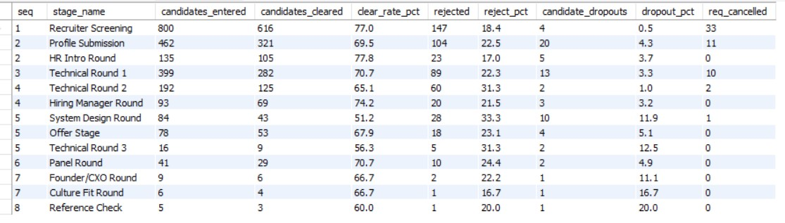

**Key Findings:**

| Stage | Entered | Cleared | Clear Rate |
|---|---|---|---|
| Recruiter Screening | 800 | 616 | 77.0% |
| Profile Submission | 462 | 321 | 69.5% |
| Technical Round 1 | 399 | 282 | 70.7% |
| Technical Round 2 | 192 | 125 | 65.1% |
| **System Design Round** | **84** | **43** | **51.2%** |
| Offer Stage | 78 | 53 | 67.9% |

**Business Insight:** System Design Round has the lowest clear rate (51.2%) and the highest dropout count — it's both the hardest round to pass and the one candidates most frequently skip. End-to-end yield is 6.6%: for every 100 candidates entering the pipeline, roughly 7 reach a cleared offer.

**Decision Impact:** Invest in candidate preparation support for System Design interviews. Investigate whether the assessment difficulty is calibrated correctly, or if scheduling friction (long lead times for this round) is driving no-shows.

---

#### Q2. What is the rejection reason breakdown at each stage?

**Why this matters:** Skills rejections at early stages are healthy filtering. Compensation rejections at late stages are expensive failures — the fix is different for each.

```sql
SELECT stage_name,
    COUNT(*) AS total_rejected,
    SUM(CASE WHEN outcome = 'Rejected – Skills' THEN 1 ELSE 0 END) AS skill_rejected,
    ROUND(SUM(CASE WHEN outcome = 'Rejected – Skills' THEN 1 ELSE 0 END)*100/COUNT(*),2) AS skill_rejected_pct,
    SUM(CASE WHEN outcome = 'Rejected – Culture Fit' THEN 1 ELSE 0 END) AS culture_fit_rejected,
    ROUND(SUM(CASE WHEN outcome = 'Rejected – Culture Fit' THEN 1 ELSE 0 END)*100/COUNT(*),2) AS culture_fit_rejected_pct,
    SUM(CASE WHEN outcome = 'Rejected – Compensation Mismatch' THEN 1 ELSE 0 END) AS comp_mismatch,
    ROUND(SUM(CASE WHEN outcome = 'Rejected – Compensation Mismatch' THEN 1 ELSE 0 END)*100/COUNT(*),2) AS comp_mismatch_pct
FROM application_stages
WHERE outcome LIKE 'Rejected%'
GROUP BY stage_name
ORDER BY MIN(stage_sequence);
```

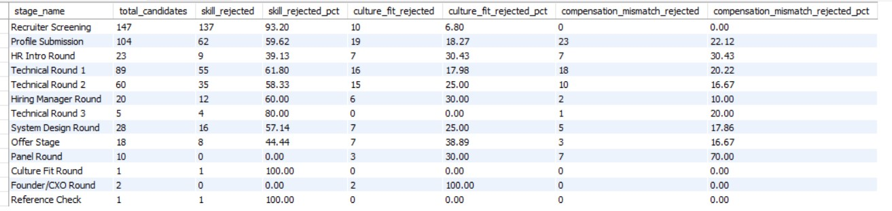

**Key Findings:**
- **Recruiter Screening:** 93.2% skills-based — the gate is working as designed
- **Panel Round:** 70% Compensation Mismatch — by this stage, technical ability is proven; the only rejection drivers are money and fit
- **HR Intro Round:** 30.4% Compensation Mismatch — catching salary misalignment early (stage 2), before expensive technical interviews
- Compensation rejections are invisible at early stages but grow steadily through the pipeline

**Decision Impact:** Panel Round compensation rejections represent the most expensive failure point — 5+ interviews invested before losing a candidate over money. Earlier salary benchmarking conversations could eliminate these.

---

### Theme 2 — Time-to-Fill & Hiring Velocity

---

#### Q3. Which departments are chronically missing their target fill days?

**Why this matters:** Every day a role stays unfilled has a cost — lost productivity, team burnout, delayed projects. Departments that consistently miss targets need structural intervention.

```sql
WITH targets AS (
    SELECT department, target_fill_days,
        DATEDIFF(date_closed, date_opened) AS actual_fill_days,
        (DATEDIFF(date_closed, date_opened) - target_fill_days) AS overshoot
    FROM job_requisitions
    WHERE req_status = 'Filled'
)
SELECT department,
    ROUND(AVG(target_fill_days),2) AS avg_target_fill_days,
    ROUND(AVG(actual_fill_days),2) AS avg_actual_fill_days,
    ROUND(AVG(overshoot),2) AS overall_avg_overshoot,
    ROUND(AVG(CASE WHEN overshoot > 0 THEN overshoot ELSE NULL END), 2) AS avg_overshoot_when_delayed,
    COUNT(*) AS total_filled,
    SUM(CASE WHEN overshoot > 0 THEN 1 ELSE 0 END) AS delayed_count
FROM targets
GROUP BY department;
```
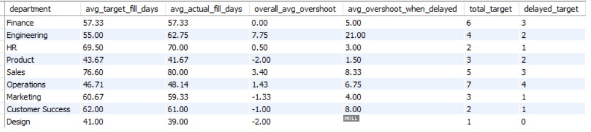

**Key Findings:**

| Department | Avg Target | Avg Actual | Avg Overshoot (when delayed) | Miss Rate |
|---|---|---|---|---|
| Engineering | 55 days | 62.75 days | **21.0 days** | 50% |
| Operations | 46.71 days | 48.14 days | 6.75 days | **57%** |
| Sales | 76.60 days | 80.00 days | 8.33 days | 60% |
| Finance | 57.33 days | 57.33 days | 5.00 days | 50% |

**Business Insight:** Engineering has the most *severe* delays (21 days average overshoot), while Operations has the most *consistent* delays (57% of reqs miss target). Finance looks perfect on the surface (0.00 average overshoot) — but that's because early fills mask late ones. Three out of six Finance reqs actually missed target.

**Decision Impact:** Engineering needs pipeline acceleration (parallel scheduling, faster feedback loops). Operations needs systematic process review — their high miss rate suggests a structural issue, not one-off difficult searches.

---

#### Q4. Are Critical priority requisitions actually being filled faster?

```sql
WITH attf AS (
    SELECT priority,
        ROUND(AVG(target_fill_days),2) AS avg_target_fill_days,
        ROUND(AVG(DATEDIFF(date_closed,date_opened)),2) AS avg_days_to_fill
    FROM job_requisitions
    WHERE req_status = 'Filled'
    GROUP BY priority
)
SELECT *, ROUND(avg_days_to_fill*100/avg_target_fill_days,2) AS pct_target_taken
FROM attf;
```

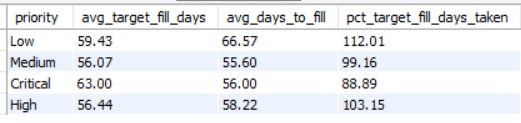

**Key Findings:** Critical reqs fill at 88.89% of target (7 days ahead). Low priority reqs overshoot at 112%. The priority system works — but it's zero-sum. Every hour spent rushing a Critical hire is taken from a Low priority one.

---

### Theme 3 — Source Channel Effectiveness

---

#### Q5. Which source channels have the highest stage clear rate and offer-to-acceptance rate?

**Why this matters:** Sourcing budget allocation should be driven by which channels produce candidates who both survive the pipeline and accept offers — not just which channels produce the most volume.

**Part A — Stage Clear Rate:**

```sql
SELECT c.source_channel,
    COUNT(*) AS total_stages,
    SUM(CASE WHEN outcome = 'Cleared' THEN 1 ELSE 0 END) AS candidates_cleared,
    ROUND(SUM(CASE WHEN outcome = 'Cleared' THEN 1 ELSE 0 END)*100/COUNT(*),2) AS clearing_pct
FROM candidates c
JOIN application_stages a ON c.candidate_id = a.candidate_id
GROUP BY c.source_channel;
```
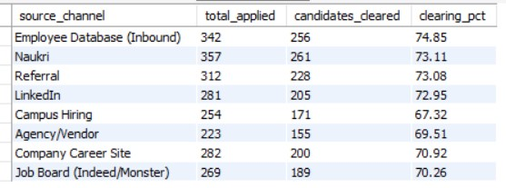

**Part B — Offer Acceptance Rate:**

```sql
SELECT c.source_channel,
    COUNT(*) AS total_offers,
    SUM(CASE WHEN offer_status = 'Accepted' THEN 1 ELSE 0 END) AS candidates_accepted,
    ROUND(SUM(CASE WHEN offer_status = 'Accepted' THEN 1 ELSE 0 END)*100/COUNT(*),2) AS acceptance_pct
FROM candidates c
JOIN offers o ON c.candidate_id = o.candidate_id
GROUP BY c.source_channel;
```
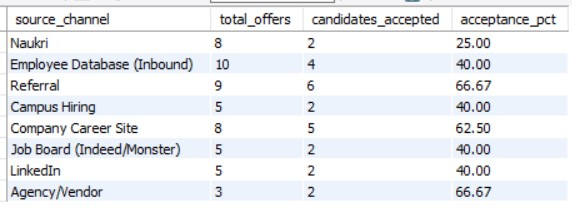

**Key Findings:**

| Channel | Clear Rate | Accept Rate | Profile |
|---|---|---|---|
| Employee Database (Inbound) | **74.85%** (best) | 40.00% | Interviews well, declines offers |
| Referral | 73.08% | **66.67%** (best) | Strong at every stage |
| Agency/Vendor | 69.51% | 66.67%* | Low quality, small sample |
| Campus Hiring | 67.32% (worst) | 40.00% | Weakest pipeline performance |
| Naukri | 73.11% | **25.00%** (worst) | Interviews well, rarely accepts |

**Business Insight:** Clear rate and acceptance rate measure different things and don't always move together. Employee Database candidates interview brilliantly but decline 60% of offers — they're likely using your process for market validation rather than a genuine job switch. Referral is the only channel that performs consistently across both dimensions.

---

#### Q6. What does the full end-to-end yield look like by source?

**Why this matters:** The ultimate metric isn't who clears interviews — it's who actually joins the company.

```sql
WITH offer_funnel AS (
    SELECT c.source_channel,
        COUNT(DISTINCT c.candidate_id) AS total_candidates,
        COUNT(DISTINCT CASE WHEN stage_name = 'Offer Stage' THEN c.candidate_id END) AS reached_offer,
        COUNT(DISTINCT CASE WHEN stage_name = 'Offer Stage' AND outcome = 'Cleared'
            THEN c.candidate_id END) AS offer_cleared,
        COUNT(DISTINCT CASE WHEN offer_status = 'Accepted' THEN c.candidate_id END) AS accepted,
        COUNT(DISTINCT CASE WHEN offer_status = 'Accepted' AND joining_date IS NOT NULL
            THEN c.candidate_id END) AS joined
    FROM candidates c
    LEFT JOIN application_stages a ON c.candidate_id = a.candidate_id
    LEFT JOIN offers o ON c.candidate_id = o.candidate_id
    GROUP BY c.source_channel
)
SELECT source_channel, total_candidates,
    reached_offer,
    ROUND(reached_offer * 100 / total_candidates, 2) AS offer_stage_pct,
    offer_cleared,
    ROUND(offer_cleared * 100 / total_candidates, 2) AS offer_cleared_pct,
    accepted,
    ROUND(accepted * 100 / total_candidates, 2) AS acceptance_pct,
    joined,
    ROUND(joined * 100 / total_candidates, 2) AS joined_pct
FROM offer_funnel;
```
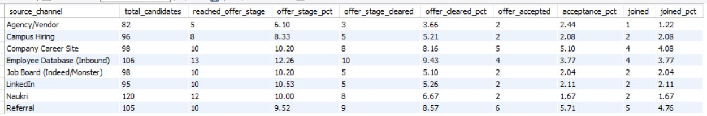

**Key Findings:**

| Channel | Candidates | Joined | Yield |
|---|---|---|---|
| Referral | 105 | 5 | **4.76%** (best) |
| Company Career Site | 98 | 4 | **4.08%** |
| Employee Database | 106 | 4 | 3.77% |
| Naukri | 120 | 2 | 1.67% |
| Agency/Vendor | 82 | 1 | **1.22%** (worst) |

**Decision Impact:** Doubling down on Referral (4.76% yield) and Company Career Site (4.08%) produces more hires per interview-hour than pumping volume through Naukri (1.67%) or Agency/Vendor (1.22%). A referral program investment has the highest measurable ROI.

---

#### Q7. Which source channels have the highest ghosting and no-show rates?

```sql
SELECT source_channel, COUNT(*) AS total_stages,
    SUM(CASE WHEN outcome = 'Candidate Ghosted' THEN 1 ELSE 0 END) AS candidate_ghosted,
    SUM(CASE WHEN outcome IN ('Interview No-Show', 'Candidate Ghosted', 'Candidate Withdrew')
        THEN 1 ELSE 0 END) AS total_dropouts,
    ROUND(SUM(CASE WHEN outcome IN ('Interview No-Show', 'Candidate Ghosted', 'Candidate Withdrew')
        THEN 1 ELSE 0 END) * 100 / COUNT(*), 2) AS dropout_pct
FROM application_stages a
JOIN candidates c ON a.candidate_id = c.candidate_id
GROUP BY source_channel
ORDER BY dropout_pct DESC;
```
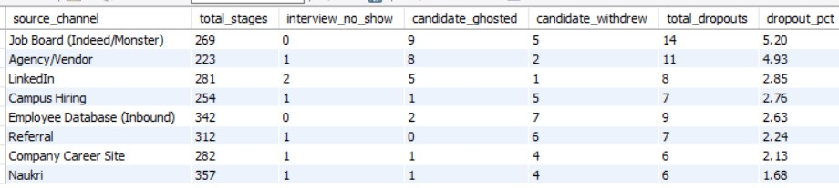


**Key Findings:** Job Board (5.20%) and Agency/Vendor (4.93%) have dropout rates roughly double the best channels. Referral has **zero** ghosting instances — the personal connection makes it socially harder to vanish. The dropout-by-stage analysis shows System Design Round has the highest no-show rate (5 of 7 total no-shows), while Profile Submission has the highest absolute dropout volume (20 candidates), driven by client response wait times.

---

### Theme 4 — Recruiter Performance

---

#### Q8. Is there a specific recruiter creating bottlenecks with slow turnaround?

**Why this matters:** Candidate experience degrades with every day of silence between interviews. One slow recruiter can drag down the entire pipeline, increasing ghosting and offer declines.

```sql
WITH turnaround AS (
    SELECT *,
        LAG(stage_date) OVER (PARTITION BY candidate_id ORDER BY stage_sequence) AS prev_stage_date,
        DATEDIFF(stage_date, LAG(stage_date) OVER (PARTITION BY candidate_id
            ORDER BY stage_sequence)) AS turnaround_time
    FROM application_stages
)
SELECT recruiter_id, recruiter_name,
    ROUND(AVG(turnaround_time),2) AS avg_turnaround_time,
    COUNT(turnaround_time) AS stage_transitions
FROM turnaround t
JOIN job_requisitions j ON t.req_id = j.req_id
JOIN recruiters r ON j.assigned_recruiter_id = r.recruiter_id
GROUP BY recruiter_id
ORDER BY avg_turnaround_time DESC;
```
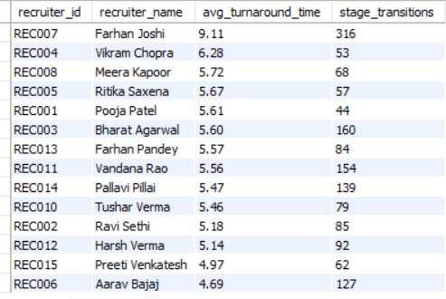

**Key Findings:**

| Recruiter | Avg Gap (days) | Transitions | Status |
|---|---|---|---|
| **REC007 — Farhan Joshi** | **9.11** | **468** | 🔴 Bottleneck |
| REC004 — Vikram Chopra | 6.28 | 80 | Normal |
| REC008 — Meera Kapoor | 5.72 | 96 | Normal |
| REC006 — Aarav Bajaj | 4.69 | 213 | ✅ Fastest |

**Business Insight:** REC007 (Farhan Joshi) is **63% slower** than the team average of ~5.5 days. This isn't a small-sample anomaly — with 468 transitions, he handles the most candidate activity in the entire system and is consistently the slowest. The combination of high volume and slow turnaround makes him the clearest bottleneck in the pipeline.

**Decision Impact:** Investigate whether this is a workload issue (too many reqs assigned) or a process issue. Consider redistributing reqs to faster recruiters, or providing scheduling support to reduce the gap.

---

#### Q9. Do slow recruiters also show higher ghosting rates?

```sql
SELECT recruiter_id, recruiter_name, COUNT(*) AS total_stages,
    SUM(CASE WHEN outcome IN ('Candidate Ghosted', 'Interview No-Show')
        THEN 1 ELSE 0 END) AS candidate_dropped,
    ROUND(SUM(CASE WHEN outcome IN ('Candidate Ghosted', 'Interview No-Show')
        THEN 1 ELSE 0 END) * 100 / COUNT(*), 2) AS dropout_pct
FROM application_stages a
JOIN job_requisitions j ON a.req_id = j.req_id
JOIN recruiters r ON j.assigned_recruiter_id = r.recruiter_id
GROUP BY recruiter_id, recruiter_name
ORDER BY dropout_pct DESC;
```
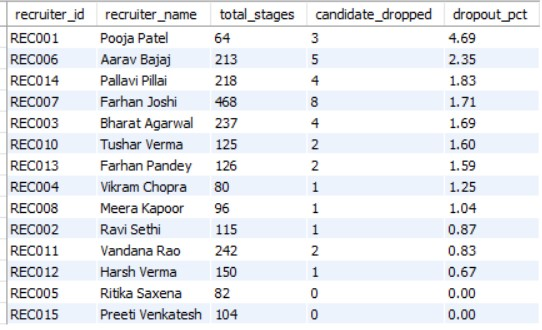

**Key Findings:** REC007 has a 1.71% dropout rate — elevated but not the worst (REC001 at 4.69% leads). The slow turnaround creates conditions for ghosting, but the data shows the relationship isn't perfectly linear — other factors (source channel mix, role difficulty) also play a role.

---

### Theme 5 — Offer Economics & Competitiveness

---

#### Q10. How often do offers exceed the approved budget?

```sql
SELECT department,
    SUM(CASE WHEN total_ctc_offered_lpa - total_budget_lpa > 0
        THEN total_ctc_offered_lpa - total_budget_lpa ELSE 0 END) AS overbudget_cost_lpa,
    ROUND(AVG(CASE WHEN total_ctc_offered_lpa - total_budget_lpa > 0
        THEN total_ctc_offered_lpa - total_budget_lpa ELSE NULL END), 2) AS avg_overshoot_when_over,
    COUNT(CASE WHEN total_ctc_offered_lpa - total_budget_lpa > 0 THEN 1 ELSE NULL END) AS overbudget_count,
    COUNT(*) AS total_offers,
    ROUND(COUNT(CASE WHEN total_ctc_offered_lpa - total_budget_lpa > 0 THEN 1 ELSE NULL END)
        *100/COUNT(*),2) AS over_budget_pct
FROM offers o
JOIN job_requisitions j ON o.req_id = j.req_id
GROUP BY department;
```
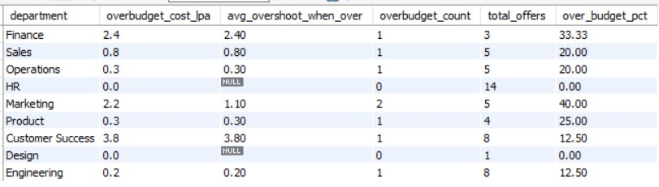

**Key Findings:**
- **Marketing:** 40% of offers break budget (highest frequency) — budgets may be set too tight for market rates
- **Customer Success:** Single largest overshoot at ₹3.80 LPA — an expensive one-off exception
- **HR & Design:** Zero overruns — HR sets comp policy and follows it; Design had too few offers to draw conclusions
- **Engineering:** Only ₹0.20 LPA overshoot despite having the worst time-to-fill — their hiring problem is speed, not budget

The role_level analysis reveals overshoot magnitude scales with seniority (Entry: ₹0.23 → Manager: ₹3.80), but Director/VP roles have zero overruns due to stricter approval processes at senior levels.

---

#### Q11. What are the top reasons candidates decline offers?

```sql
SELECT decline_reason,
    COUNT(*) AS offers_declined,
    ROUND(COUNT(*) * 100 / (SELECT COUNT(*) FROM offers WHERE offer_status = 'Declined'), 2) AS decline_pct
FROM offers
WHERE offer_status = 'Declined'
GROUP BY decline_reason;
```
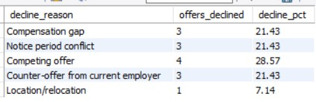

**Key Findings:**

| Decline Reason | Count | % of Declines |
|---|---|---|
| Competing offer | 4 | 28.57% |
| Compensation gap | 3 | 21.43% |
| Counter-offer from current employer | 3 | 21.43% |
| Notice period conflict | 3 | 21.43% |
| Location/relocation | 1 | 7.14% |

**Business Insight:** 71.43% of declines are about money in some form (competing offer + comp gap + counter-offer). The remaining declines are logistical (notice period, location). This suggests the firm's compensation benchmarking may be lagging the market.

---

### Theme 6 — Ghost Joiner Analysis

---

#### Q12. What percentage of accepted offers result in no joining date?

```sql
SELECT department,
    SUM(CASE WHEN joining_date IS NULL THEN 1 ELSE 0 END) AS ghost_joiners,
    COUNT(*) AS dept_accepted,
    ROUND(SUM(CASE WHEN joining_date IS NULL THEN 1 ELSE 0 END)* 100 / COUNT(*), 2) AS ghost_rate_pct
FROM offers o
JOIN job_requisitions j ON o.req_id = j.req_id
WHERE offer_status = 'Accepted'
GROUP BY department;
```
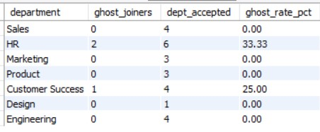

**Key Findings:** HR shows a 33.33% ghost joiner rate (2 out of 6 accepted offers never joined), and Customer Success shows 25.00% (1 of 4). These are candidates who formally accepted the offer and then disappeared — the most expensive failure mode in the entire pipeline.

**Decision Impact:** Implement a structured post-acceptance engagement program (regular check-ins during notice period, early onboarding activities) to reduce ghost joiners. Focus on departments with the highest ghost rates first.

---

## Key Findings Summary

| Finding | Metric | Business Impact |
|---|---|---|
| System Design Round is the biggest bottleneck | 51.2% clear rate (lowest) | Half the candidates who reach this round are lost |
| Referral is the highest-yield source channel | 4.76% application-to-joining rate | 3x more efficient than Job Board/Agency |
| REC007 is a measurable recruiter bottleneck | 9.11 days avg gap vs 5.5 team avg | 63% slower turnaround, highest volume |
| Engineering has the most severe fill delays | 21 days overshoot when delayed | Nearly 3 extra weeks per delayed hire |
| 71% of offer declines are compensation-related | Comp gap + competing offer + counter-offer | Market benchmarking may be lagging |
| Budget overrides concentrate mid-seniority | Lead/Manager/Senior levels | Approval processes need tightening at this tier |
| Ghost joiners concentrate in HR and Customer Success | 33% and 25% ghost rates respectively | Post-acceptance engagement needed |
| Job Board/Agency have 2x the ghosting rate of Referral | 5.2% vs 0.0% | Low-commitment channels need different management |

---

## Recommendations

Based on the analysis, here are prioritized actions for the leadership team:

1. **Invest in the Referral program** — it has the best end-to-end yield (4.76%) and zero ghosting. A structured referral bonus program would likely be more cost-effective than increasing Job Board/Agency spend.

2. **Audit the System Design Round** — with a 51.2% clear rate and the highest no-show count, this stage needs attention. Consider candidate preparation guides, flexible scheduling, or splitting it into a shorter screening + deeper dive.

3. **Redistribute REC007's workload** — one recruiter handling the highest volume at the slowest speed is a systemic risk. Either reduce their req count or provide scheduling support.

4. **Implement earlier salary conversations** — 71% of offer declines are money-related. Moving compensation discussion to stage 2–3 (instead of post-final-round) would prevent expensive late-stage fallouts.

5. **Build a post-acceptance engagement program** — ghost joiners (accepted but never joined) represent the most expensive pipeline failure. Regular touchpoints during notice periods can reduce this.

6. **Tighten budget governance at Lead/Manager/Senior levels** — Director/VP hires have zero budget overruns (due to board-level oversight). Extend similar approval rigor to the mid-senior tier where overruns concentrate.

---

## SQL Techniques Used

| Technique | Where Applied |
|---|---|
| **Common Table Expressions (CTEs)** | Time-to-fill analysis, recruiter turnaround, end-to-end funnel |
| **Window Functions — LAG()** | Stage-to-stage turnaround calculation |
| **Conditional Aggregation** | Funnel conversion, rejection breakdown, dropout rates |
| **Multi-table JOINs** | Source channel analysis (3-table), recruiter performance (3-table) |
| **LEFT JOINs** | End-to-end yield (preserving candidates with no offers) |
| **Subqueries in SELECT** | Percentage calculations with fixed denominators |
| **COUNT(DISTINCT CASE WHEN...)** | Deduplicating candidates across multi-table joins |
| **DATEDIFF** | Time-to-fill, stage gap calculations |
| **NULL handling (NULLIF, IS NULL)** | Ghost joiner identification, fresher CTC handling |

---

## Key Learnings

- **Synthetic data design is an analytical skill in itself** — baking intentional patterns (bottleneck recruiter, source channel bias, budget overrides) into the data taught me to think about what analysis should discover, then work backward to the data structures that enable it.

- **The same metric can tell different stories depending on the denominator** — `AVG(overshoot)` across all reqs showed Finance at 0.00 (looks perfect). `AVG(overshoot WHERE overshoot > 0)` revealed they miss target by 5 days when they do miss. Choosing the right denominator is a critical analytical decision.

- **COUNT vs SUM for boolean conditions** — `COUNT(overshoot > 0)` counts all non-NULL values (always equals total rows). `SUM(overshoot > 0)` counts only TRUE values. A subtle MySQL behavior that produces silently wrong results if misunderstood.

- **Window functions unlock questions that aggregation alone cannot answer** — recruiter turnaround required comparing consecutive rows within a candidate's stage history. `LAG()` made this possible without self-joins.

- **Business context transforms a query into an insight** — "System Design Round has a 51.2% clear rate" is a fact. "System Design Round is both the hardest assessment and the one candidates most frequently skip — it needs a scheduling and preparation redesign" is an insight that drives action.

---

*Built as a portfolio project demonstrating SQL analytics, business problem framing, and data-driven decision-making.*
